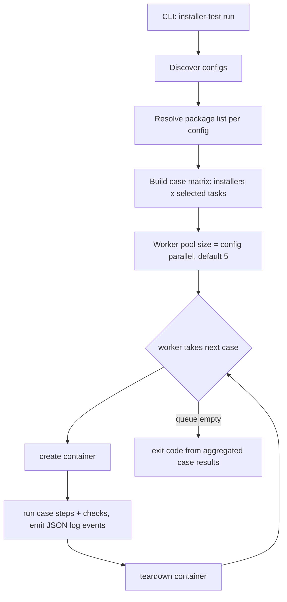

# Container-Per-Task Plan (v2) — task splitting, per-case isolation, parallel runs & JSON logs

> Status: **DRAFT — awaiting confirmation**
> Baseline: the implemented v1 design in `docs/installer-testing-tool-plan.md`.
> This plan changes **how cases are composed, isolated and executed**, plus the output model. The config schema keeps everything from v1 and gains **one optional key (`parallel`)**.

## 1. What changes from v1

| Topic | v1 (current) | v2 (this plan) |
|-------|--------------|----------------|
| Task set | install + uninstall are **one set**; uninstall always chains install | **independent tasks** — each task is its own case |
| Container granularity | one container per environment, all installers, both phases | **one container per (installer file × task) case** |
| `--task uninstall` | not allowed standalone (implies install) | runs standalone: its container does install (setup) → uninstall → uninstall checks internally |
| Execution | serial, one container alive | **parallel cases**, bounded by config `parallel` (default **5**) |
| Console output | human-readable text, printed live | **live JSON logs** (one JSON object per line, NDJSON) |
| End-of-run report | summary printed at the end | **none** — the tool only emits logs and exits |
| Report generation | n/a | separate **`report` subcommand** builds a report from captured logs |
| Report unit | check (within one env run) | **case** = (environment, installer file, task) |

## 2. Case matrix

A run expands the config into a matrix of independent cases — one **fresh container per cell**:

```
configs/ubuntu-24.04.yaml  (pattern "bin/*.rpm" matches 3 files)

my-app-0.1.0.rpm  -> fresh-install -> create container
my-app-0.1.0.rpm  -> uninstall     -> create container
my-app-0.1.1.rpm  -> fresh-install -> create container
my-app-0.1.1.rpm  -> uninstall     -> create container
my2-0.1.0.rpm     -> fresh-install -> create container
my2-0.1.0.rpm     -> uninstall     -> create container
```

Selected tasks (`--task`) filter the matrix; with no `--task`, all tasks produce cells.

## 3. Case lifecycle

### `fresh-install` case

```
create container -> copy installer -> install_command -> install_checks -> teardown
```

### `uninstall` case (now standalone)

```
create container -> copy installer -> install (SETUP, must succeed, no install_checks)
                  -> uninstall_command -> uninstall_checks -> teardown
```

- The install step inside an `uninstall` case is **task setup**, not the thing under test.
- If the setup install fails, the case fails immediately (setup error) and uninstall never runs.
- Setup install runs **no checks** — `install_checks` belong to the `fresh-install` case only. It is still **logged** as a `step` event (see section 6).

## 4. Parallel execution

- Cases execute **in parallel** through a bounded worker pool.
- Concurrency limit comes from the config: optional top-level **`parallel`** key per environment file, **default `5`**, minimum `1`.
- Environments (config files) run **sequentially**; within one environment, its cases run in parallel up to that environment's `parallel` limit. (A global cross-env pool is a possible follow-up — open question 5.)
- One case failing never stops the matrix — every case runs, all failures aggregate into the exit code.
- Teardown always happens (deferred per case) unless `--keep`.
- Safe ordering: log emission is serialized (mutex); case results are collected and counted after all workers finish.

```yaml
# configs/ubuntu-24.04.yaml
parallel: 5            # optional, default 5, min 1
environment:
  name: ubuntu-24.04
  type: docker
  image: ubuntu:24.04
installers:
  - pattern: "bin/*.rpm"
    ...
```

## 5. Orchestration (runner changes)



## 6. Live JSON logging (new output model)

- Every event is printed **immediately** (live) to **stdout** as **one JSON object per line** (NDJSON), from all parallel workers safely (serialized writes).
- The tool prints **nothing else** — no headers, no end-of-run summary (section 7).

### Event envelope

Every line shares the same envelope; `data` carries event-specific fields:

```json
{"ts":"2026-10-09T12:00:00.123Z","level":"info","event":"case_start","env":"ubuntu-24.04","task":"fresh-install","installer":"my-app-0.1.0.rpm","data":{...}}
```

### Event types

| Event         | Level    | When | Extra `data` fields |
|---------------|----------|------|---------------------|
| `run_start`   | info     | run begins | configs, cases, parallel |
| `env_start`   | info     | one environment's batch begins | image, workdir |
| `case_start`   | info     | container created for a case | container_id |
| `step`         | info/error | copy / setup-install / install / uninstall executed | kind, command, exit_code, pass, output (truncated) |
| `check`        | info/error | one check executed | kind (`file`/`command`), name, pass, exit_code, expected_exit_code, expected_stdout_contains, detail, output (truncated) |
| `case_end`     | info/error | case finished (after teardown) | pass, passed, failed, duration_ms |
| `env_end`      | info     | environment's batch finished | passed, failed |
| `error`        | error    | infrastructure error (config load, container start, docker down...) | message |

### Example session

```json
{"ts":"...","level":"info","event":"run_start","data":{"configs":1,"cases":6,"parallel":5}}
{"ts":"...","level":"info","event":"case_start","env":"ubuntu-24.04","task":"fresh-install","installer":"my-app-0.1.0.rpm","data":{"container_id":"a1b2"}}
{"ts":"...","level":"info","event":"step","env":"ubuntu-24.04","task":"fresh-install","installer":"my-app-0.1.0.rpm","data":{"kind":"install","command":"rpm -ivh /tmp/my-app-0.1.0.rpm","exit_code":0,"pass":true}}
{"ts":"...","level":"info","event":"check","env":"ubuntu-24.04","task":"fresh-install","installer":"my-app-0.1.0.rpm","data":{"kind":"command","name":"rpm -q my-app","pass":true,"exit_code":0}}
{"ts":"...","level":"info","event":"case_end","env":"ubuntu-24.04","task":"fresh-install","installer":"my-app-0.1.0.rpm","data":{"pass":true,"passed":2,"failed":0,"duration_ms":4200}}
```

## 7. No end-of-run report; report generated from logs

- The `run` subcommand **prints no report and no summary** at the end. It only streams JSON log lines live and exits (`0` = every case passed, non-zero otherwise).
- To generate a human-readable report **afterwards**, the user captures the logs and feeds them to the new **`report`** subcommand, which parses NDJSON and renders a summary grouped by env / installer / task:

```sh
# capture logs while running
./installer-test run | tee run.jsonl

# generate the report from the captured logs
./installer-test report --from run.jsonl              # human-readable text on stdout
./installer-test report --from run.jsonl --format markdown > report.md
./installer-test report --from run.jsonl --format junit > junit.xml   # (future)
```

- `report` reads a file (`--from`) or stdin (`-`), tolerates incomplete logs (e.g. aborted runs — reports what it finds), and flags runs that never emitted `run_end`.
- Formats: **`text`** (default) and **`markdown`**; JUnit XML is a possible follow-up.

## 8. Code impact (mapping to the current code)

| File | Change |
|------|--------|
| `internal/config/` | new optional top-level `parallel` key (int, default 5, min 1); validation |
| `internal/task/task.go` | `Task.Run` operates on **one** `*config.ResolvedInstaller` instead of a `Bundle`; emits log events instead of returning check slices for printing |
| `internal/task/install.go` | single-installer install case (copy + install + install_checks), logging via emitter |
| `internal/task/uninstall.go` | standalone case: copy + install (setup, logged as `step`, unchecked) + uninstall + uninstall_checks |
| `internal/runner/runner.go` | case matrix builder + **bounded worker pool** (size from config); no printing, no summary; aggregates results for the exit code |
| `internal/logging/` (new) | thread-safe NDJSON emitter (envelope + event types from section 6) |
| `internal/report/` | repurposed: no live output; parses NDJSON and renders text/markdown reports |
| `cmd/installer-test/main.go` | new `report` subcommand (`--from FILE|-`, `--format text|markdown`); `--task uninstall` valid standalone |
| `internal/env/docker.go` | no functional change; optional deterministic container name for `--keep` debugging |
| config schema (rest) | **unchanged** — checks, placeholders, defaults stay as documented in the README reference |

## 9. Consequences & trade-offs

- **Isolation:** no state bleed between files/tasks — a broken uninstall can't pollute a fresh-install result.
- **Cost:** container count grows from 1 per env to (files × tasks) per env, but parallelism (default 5) bounds wall-clock time; docker load is the practical limit.
- **Log-first output:** live JSON is less readable raw, but it is machine-parseable, and the human view is one `report` invocation away; `tee` keeps both worlds.
- **Checks remain per-installer** — a pattern matching N files produces N case-pairs, each running that installer entry's checks (same as v1 semantics).

## 10. Open questions (need your input)

1. **Report format(s)** — `text` + `markdown` as proposed, or a different default (e.g. markdown)? JUnit XML now or later?
2. **`--keep` in parallel mode** — keep every case's container, or only failed cases' (proposed: only failed + always log container IDs)?
3. **Installer filter** — add a `--installer GLOB` flag to select a subset of the package list once the matrix is big?
4. **Container naming** — deterministic names like `ita-ubuntu24-04-myapp-0010-fresh-install` when `--keep` is used, or testcontainers' random names?
5. **Cross-env concurrency** — environments sequential, each using its own `parallel` limit (proposed), or a single global pool sized by the max of all configs?
6. **CLI override for parallel** — also allow `--parallel N` on the CLI overriding the config value?
