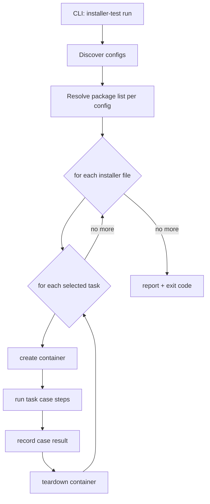

# Container-Per-Task Plan (v2) — task splitting & per-case isolation

> Status: **DRAFT — awaiting confirmation**
> Baseline: the implemented v1 design in `docs/installer-testing-tool-plan.md`.
> This plan changes **how cases are composed and isolated**, not the config schema, checks or CLI flags.

## 1. What changes from v1

| Topic | v1 (current) | v2 (this plan) |
|-------|--------------|----------------|
| Task set | install + uninstall are **one set**; uninstall always chains install | **independent tasks** — each task is its own case |
| Container granularity | **one container per environment**, all installers, both phases | **one container per (installer file × task) case** |
| `--task uninstall` | not allowed standalone (implies install) | runs standalone: its container does install (setup) → uninstall → uninstall checks internally |
| Report unit | check (within one env run) | **case** = (environment, installer file, task) |

## 2. Case matrix

A run expands the config into a matrix of independent cases — one **fresh container per cell**:

```
configs/ubuntu-24.04.yaml  (pattern "bin/*.rpm" matches 3 files)

my-app-0.1.0.rpm  -> fresh-install -> create container
my-app-0.1.0.rpm  -> uninstall     -> create container
my-app-0.1.1.rpm  -> fresh-install -> create container
my-app-0.1.1.rpm  -> uninstall     -> create container
my2-0.1.0.rpm     -> fresh-install -> create container
my2-0.1.0.rpm     -> uninstall     -> create container
```

Selected tasks (`--task`) filter the matrix; with no `--task`, all tasks produce cells.

## 3. Case lifecycle

### `fresh-install` case

```
create container -> copy installer -> install_command -> install_checks -> teardown
```

### `uninstall` case (now standalone)

```
create container -> copy installer -> install (SETUP, must succeed, no install_checks)
                  -> uninstall_command -> uninstall_checks -> teardown
```

- The install step inside an `uninstall` case is **task setup**, not the thing under test.
- If the setup install fails, the case fails immediately (setup error) and uninstall never runs.
- Setup install runs **no checks** — `install_checks` belong to the `fresh-install` case only.

## 4. Orchestration (runner changes)



- Cases run **serially** in v2.0 (one container alive at a time); parallel execution is a possible follow-up (open question 1).
- One case failing never stops the matrix — every case runs, all failures aggregate into the exit code.
- Teardown always happens (deferred per case) unless `--keep`.

## 5. Code impact (mapping to the current code)

| File | Change |
|------|--------|
| `internal/task/task.go` | `Task.Run` operates on **one** `*config.ResolvedInstaller` instead of a `Bundle`; add a `Setup` step concept for uninstall |
| `internal/task/install.go` | becomes the single-installer install case (copy + install + install_checks) |
| `internal/task/uninstall.go` | standalone case: internally does copy + install (setup, unchecked) + uninstall + uninstall_checks |
| `internal/runner/runner.go` | new case loop: for each bundle → for each installer → for each task → env create/start → task → stop; remove the install→uninstall chaining |
| `internal/env/docker.go` | no functional change; optional: deterministic container name (`<env>-<basename>-<task>`) for `--keep` debugging |
| `internal/report/report.go` | group output by case: `== env / installer / task` header, per-case and overall totals |
| `cmd/installer-test/main.go` | no flag changes; `--task uninstall` becomes valid standalone |
| config schema | **unchanged** — `configs/*.yaml`, checks, placeholders, defaults all stay as documented in the README reference |

## 6. Reporting

```
== env ubuntu-24.04 / installer my-app-0.1.0.rpm / task fresh-install
PASS    [my-app-0.1.0.rpm] install: rpm -ivh /tmp/my-app-0.1.0.rpm
PASS    [my-app-0.1.0.rpm] command: rpm -q my-app
== case passed (2/2 checks)

== env ubuntu-24.04 / installer my-app-0.1.0.rpm / task uninstall
PASS    [my-app-0.1.0.rpm] setup install: rpm -ivh /tmp/my-app-0.1.0.rpm
PASS    [my-app-0.1.0.rpm] uninstall: rpm -e my-app
PASS    [my-app-0.1.0.rpm] command: rpm -q my-app (expected exit 1)
== case passed (3/3 checks)
...
== 6 cases: 6 passed, 0 failed
```

Exit code `0` only if **every case** passes.

## 7. Consequences & trade-offs

- **Isolation:** no state bleed between files/tasks — a broken uninstall can't pollute a fresh-install result (in v1 they shared one container).
- **Cost:** container count grows from 1 per env to (files × tasks) per env; startup dominates runtime. Serial v2 keeps it predictable.
- **Checks remain per-installer** — a pattern matching N files produces N case-pairs, each running that installer entry's checks (same as v1 semantics).

## 8. Open questions (need your input)

1. **Parallel execution** — keep cases serial for v2.0, or run containers concurrently from the start (bounded, e.g. `--parallel N`, default 1)?
2. **Setup install visibility** — should the uninstall case's setup install print as a check row (proposed above) or stay silent/summarized?
3. **`--keep` in matrix mode** — keep every case's container, or only failed cases' containers (proposed: only failed + always print IDs)?
4. **Installer filter** — add a `--installer GLOB` flag to select a subset of the package list (useful once the matrix is big)?
5. **Container naming** — deterministic names like `ita-ubuntu24-04-myapp-0010-fresh-install` when `--keep` is used, or leave testcontainers' random names?
