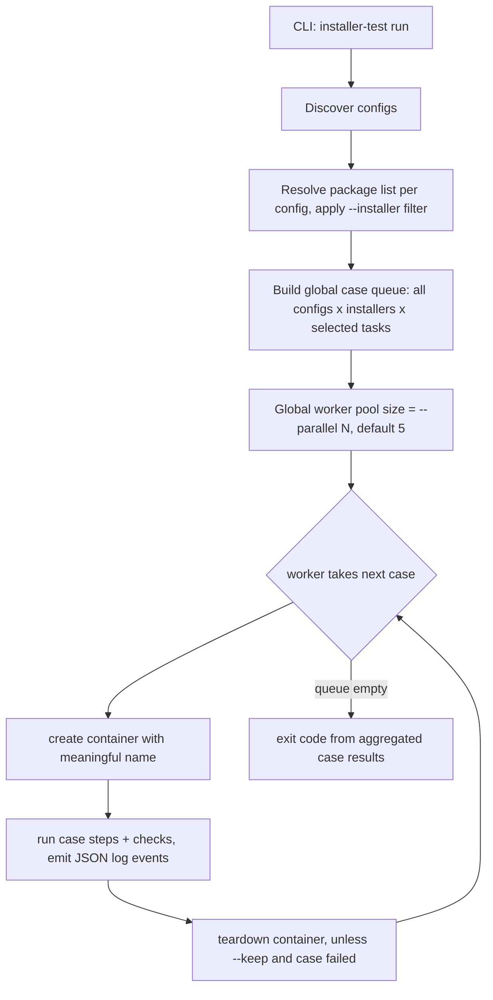

# Container-Per-Task Plan (v2) — task splitting, per-case isolation, parallel runs & JSON logs

> Status: **CONFIRMED — ready to implement**
> Baseline: the implemented v1 design in `docs/installer-testing-tool-plan.md`.
> This plan changes **how cases are composed, isolated and executed**, plus the output model. The **config schema is unchanged** from v1 (no new keys; `parallel` is CLI-only).

## 1. What changes from v1

| Topic | v1 (current) | v2 (this plan) |
|-------|--------------|----------------|
| Task set | install + uninstall are **one set**; uninstall always chains install | **independent tasks** — each task is its own case |
| Container granularity | one container per environment, all installers, both phases | **one container per (installer file × task) case** |
| `--task uninstall` | not allowed standalone (implies install) | runs standalone: its container does install (setup) → uninstall → uninstall checks internally |
| Execution | serial, one container alive | **parallel cases** through a **single global worker pool**: `--parallel N` (default **5**) caps the total containers running at any moment |
| `run` flags | `--config`, `--task`, `--keep` | adds **`--installer GLOB`** (subset of package list) and **`--parallel N`** (global concurrency) |
| Console output | human-readable text, printed live | **live JSON logs** (one JSON object per line, NDJSON) |
| End-of-run report | summary printed at the end | **none** — the tool only emits logs and exits |
| Report generation | n/a | separate **`report` subcommand** (text format) builds a report from captured logs |
| Report unit | check (within one env run) | **case** = (environment, installer file, task) |
| config schema | — | **unchanged** from v1 (README reference stays valid) |

## 2. Case matrix

A run expands the config into a matrix of independent cases — one **fresh container per cell**:

```
configs/ubuntu-24.04.yaml  (pattern "bin/*.rpm" matches 3 files)

my-app-0.1.0.rpm  -> fresh-install -> create container
my-app-0.1.0.rpm  -> uninstall     -> create container
my-app-0.1.1.rpm  -> fresh-install -> create container
my-app-0.1.1.rpm  -> uninstall     -> create container
my2-0.1.0.rpm     -> fresh-install -> create container
my2-0.1.0.rpm     -> uninstall     -> create container
```

Selected tasks (`--task`) filter the matrix; with no `--task`, all tasks produce cells.
`--installer GLOB` filters the package list before building the matrix — e.g. `--installer "bin/my-app-*.rpm"` runs only the my-app cases.

## 3. Case lifecycle

### `fresh-install` case

```
create container -> copy installer -> install_command -> install_checks -> teardown
```

### `uninstall` case (now standalone)

```
create container -> copy installer -> install (SETUP, must succeed, no install_checks)
                  -> uninstall_command -> uninstall_checks -> teardown
```

- The install step inside an `uninstall` case is **task setup**, not the thing under test.
- If the setup install fails, the case fails immediately (setup error) and uninstall never runs.
- Setup install runs **no checks** — `install_checks` belong to the `fresh-install` case only. It is still **logged** as a `step` event (section 6).

## 4. Parallel execution (confirmed: global)

- Cases from **all** discovered config files go into **one global queue**; a **single worker pool** of size `--parallel N` (default **5**, minimum 1) drains it.
- **Hard guarantee: the total number of containers running at the same time never exceeds N** — across all environments, all installers, all tasks. Cases from different configs may run mixed.
- `--parallel` is **CLI-only** (confirmed): there is **no `parallel` key in the config files**; the default is 5 for every invocation.
- One case failing never stops the matrix — every case runs, all failures aggregate into the exit code.
- Teardown always happens (deferred per case) — with one exception: **`--keep` keeps only failed cases** (section 4.1).
- Safe ordering: log emission is serialized (mutex); case results are collected and counted after all workers finish.

```sh
./installer-test run                          # at most 5 containers at once (default)
./installer-test run --parallel 10           # at most 10 containers at once
./installer-test run --parallel 1            # fully serial
```

### 4.1 Container naming & `--keep` (confirmed)

- **Meaningful, deterministic container names** for every case, always (not only with `--keep`):
  `ita-<env>-<sanitized-installer-basename>-<task>`
  e.g. `ita-ubuntu-24-04-my-app-0-1-0-fresh-install`
  (sanitized: everything except `[a-z0-9]` becomes `-`, collapsed; a short suffix is appended on name collisions).
- **`--keep` keeps only failed cases' containers.** Passing cases are always torn down. A failed case's `case_end` event carries `kept: true` so you know exactly which containers remain.
- **Container IDs are always logged** (in `case_start` and `case_end`), whether kept or not — so `docker logs` / `docker inspect` works for any case, any time.

## 5. Orchestration (runner changes)



- Environments are **not** processed sequentially — their cases share the global queue.
- `env_start` is emitted when an environment's **first** case starts; `env_end` when its **last** case finishes (with a global pool, environments overlap).

## 6. Live JSON logging (new output model)

- Every event is printed **immediately** (live) to **stdout** as **one JSON object per line** (NDJSON), from all parallel workers safely (serialized writes).
- The tool prints **nothing else** — no headers, no end-of-run summary (section 7).

### Event envelope

Every line shares the same envelope; `data` carries event-specific fields:

```json
{"ts":"2026-10-09T12:00:00.123Z","level":"info","event":"case_start","env":"ubuntu-24.04","task":"fresh-install","installer":"my-app-0.1.0.rpm","data":{...}}
```

### Event types

| Event         | Level    | When | Extra `data` fields |
|---------------|----------|------|---------------------|
| `run_start`   | info     | run begins | configs, cases, parallel |
| `env_start`   | info     | an environment's first case starts | image, workdir |
| `case_start`   | info     | container created for a case | container_id, container_name |
| `step`         | info/error | copy / setup-install / install / uninstall executed | kind, command, exit_code, pass, output (truncated) |
| `check`        | info/error | one check executed | kind (`file`/`command`), name, pass, exit_code, expected_exit_code, expected_stdout_contains, detail, output (truncated) |
| `case_end`     | info/error | case finished (after teardown decision) | container_id, pass, passed, failed, duration_ms, kept (true only when `--keep` and failed) |
| `env_end`      | info     | an environment's last case finished | passed, failed |
| `error`        | error    | infrastructure error (config load, container start, docker down...) | message |

### Example session

```json
{"ts":"...","level":"info","event":"run_start","data":{"configs":1,"cases":6,"parallel":5}}
{"ts":"...","level":"info","event":"case_start","env":"ubuntu-24.04","task":"fresh-install","installer":"my-app-0.1.0.rpm","data":{"container_id":"a1b2","container_name":"ita-ubuntu-24-04-my-app-0-1-0-fresh-install"}}
{"ts":"...","level":"info","event":"step","env":"ubuntu-24.04","task":"fresh-install","installer":"my-app-0.1.0.rpm","data":{"kind":"install","command":"rpm -ivh /tmp/my-app-0.1.0.rpm","exit_code":0,"pass":true}}
{"ts":"...","level":"info","event":"check","env":"ubuntu-24.04","task":"fresh-install","installer":"my-app-0.1.0.rpm","data":{"kind":"command","name":"rpm -q my-app","pass":true,"exit_code":0}}
{"ts":"...","level":"info","event":"case_end","env":"ubuntu-24.04","task":"fresh-install","installer":"my-app-0.1.0.rpm","data":{"container_id":"a1b2","pass":true,"passed":2,"failed":0,"duration_ms":4200}}
```

## 7. No end-of-run report; report generated from logs

- The `run` subcommand **prints no report and no summary** at the end. It only streams JSON log lines live and exits (`0` = every case passed, non-zero otherwise).
- To generate a human-readable report **afterwards**, the user captures the logs and feeds them to the new **`report`** subcommand, which parses NDJSON and renders a **text** report (confirmed: text only for now) grouped by env / installer / task:

```sh
# capture logs while running
./installer-test run | tee run.jsonl

# generate the text report from the captured logs
./installer-test report --from run.jsonl
./installer-test report --from - < run.jsonl     # read from stdin
```

- `report` reads a file (`--from FILE`) or stdin (`--from -`), tolerates incomplete logs (e.g. aborted runs — reports what it finds), and flags runs that never emitted `env_end`/`run_end`.
- More formats (markdown, JUnit XML) can be added later behind a `--format` flag; the flag is not introduced until a second format exists.

## 8. Code impact (mapping to the current code)

| File | Change |
|------|--------|
| `internal/config/` | **no schema change** — no `parallel` key (confirmed) |
| `internal/task/task.go` | `Task.Run` operates on **one** `*config.ResolvedInstaller` instead of a `Bundle`; emits log events instead of returning check slices for printing |
| `internal/task/install.go` | single-installer install case (copy + install + install_checks), logging via emitter |
| `internal/task/uninstall.go` | standalone case: copy + install (setup, logged as `step`, unchecked) + uninstall + uninstall_checks |
| `internal/runner/runner.go` | **global** case queue (all configs × installers × selected tasks) + **single global worker pool** (size `--parallel`, default 5, hard cap on live containers); `--installer` glob filter; keep-only-failed teardown logic; no printing, no summary |
| `internal/logging/` (new) | thread-safe NDJSON emitter (envelope + event types from section 6) |
| `internal/report/` | repurposed: no live output; parses NDJSON and renders the **text** report |
| `cmd/installer-test/main.go` | new `report` subcommand (`--from FILE\|-`); `run` gains `--installer GLOB` and `--parallel N`; `--task uninstall` valid standalone |
| `internal/env/docker.go` | meaningful deterministic container names (section 4.1); `--keep`-driven teardown behavior lives in the runner |
| config schema | **unchanged** — checks, placeholders, defaults stay as documented in the README reference |

## 9. Consequences & trade-offs

- **Isolation:** no state bleed between files/tasks — a broken uninstall can't pollute a fresh-install result.
- **Cost:** container count grows from 1 per env to (files × tasks) per env, but the global `--parallel` cap (default 5) bounds simultaneous docker load and wall-clock time.
- **Global pool:** mixed-environment execution maximizes utilization; the trade-off is that per-environment concurrency is not individually controllable (accepted — confirmed).
- **Log-first output:** live JSON is less readable raw, but it is machine-parseable, and the human view is one `report` invocation away; `tee` keeps both worlds.
- **Checks remain per-installer** — a pattern matching N files produces N case-pairs, each running that installer entry's checks (same as v1 semantics).

## 10. Confirmed decisions

| # | Question | Decision |
|---|----------|----------|
| 1 | Report format(s) | **text only** for now; `--format` flag deferred until a second format exists |
| 2 | `--keep` in parallel mode | keep **only failed cases'** containers; container IDs **always logged** (`case_start` + `case_end`), `kept: true` on retained ones |
| 3 | Installer filter | **yes** — `run --installer GLOB` filters the package list before building the case matrix |
| 4 | Container naming | **meaningful deterministic names** always: `ita-<env>-<sanitized-basename>-<task>` |
| 5 | Parallelism | **global, CLI-only** — `--parallel N` (default **5**, min 1); **no config key**; total containers running at once never exceed N, across all environments |
| 6 | Cross-env concurrency | **one global pool** — all cases from all configs share a single queue; environments are not processed sequentially |
| 7 | Uninstall setup visibility | logged as a `step` event (`kind: setup-install`), no check row |
