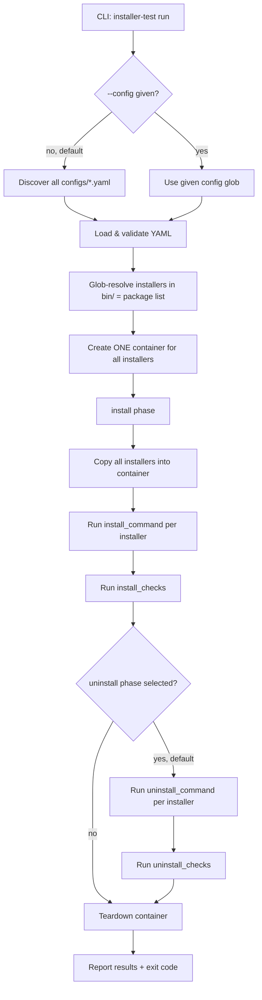

# Installer Testing Tool — Design & Implementation Plan

> Status: **CONFIRMED — ready to implement**
> Scope of this plan: the initial CLI tool that tests installer files on Linux containers via [testcontainers-go](https://golang.testcontainers.org/).

## 1. Overview

A command line tool that:

1. Reads **one YAML config file per target environment** (from `configs/`).
2. Copies **installer files** (from the repo's `bin/` folder, wildcards allowed) into a disposable container.
3. Runs **tasks** (`fresh-install`, `uninstall`) against that environment — install and uninstall are **one set**: uninstall always runs after install, in the same container.
4. Runs **checks** after each phase: files that must exist, files that must not exist, and arbitrary shell commands.
5. Reports pass/fail results per environment / task / installer / check.

The tool is built around two abstractions — **Environment** and **Task** — so new environment types (e.g. Windows via WinRM) and new tasks (e.g. upgrade, downgrade, repair) can be added without touching the core.

## 2. Tech stack

| Component   | Choice                                             |
|-------------|----------------------------------------------------|
| Language    | Go (module already exists: `go 1.26.7`)           |
| Containers  | `testcontainers-go`                                 |
| Config      | `gopkg.in/yaml.v3`                                  |
| CLI         | stdlib `flag` (keep it lean; cobra only if we outgrow it) |
| Copy/exec into container | testcontainers `Container.CopyDirToContainer` / `Exec` |

> ⚠️ **Note:** the current devcontainer has no Docker daemon. Building & unit tests work here; actual end-to-end runs need a Docker socket mounted, or must run on a machine with Docker.

## 3. Project structure

```
installer-testing-auto/
├── bin/                          # user drops installer files here (git-ignored)
├── configs/                      # one YAML per environment
│   ├── ubuntu-24.04.yaml
│   └── rocky-9.yaml
├── cmd/
│   └── installer-test/           # main entrypoint
├── internal/
│   ├── config/                   # YAML load + validate + glob resolve
│   ├── env/                      # Environment interface
│   │   ├── env.go                # interface + registry
│   │   └── docker.go             # DockerEnvironment (testcontainers-go)
│   ├── task/                     # Task interface + built-in tasks
│   │   ├── task.go               # interface + registry
│   │   ├── install.go            # FreshInstall
│   │   └── uninstall.go          # Uninstall (always after install)
│   ├── checks/                   # check runners (file-exists, file-absent, command)
│   ├── runner/                   # orchestration: config -> env -> tasks -> checks
│   └── report/                   # console + (later) JUnit/TAP output
└── docs/installer-testing-tool-plan.md
```

### Build-artifact hygiene (confirmed)

- The `installer-test` binary is a **build artifact only** — it is never committed to the repo.
- Workflow: `go build` → run build/smoke tests → **delete the binary** afterwards.
- `.gitignore` covers: `bin/` (user installer files), built binaries, and `dist/` if ever used.

## 4. Environment abstraction

```go
// internal/env/env.go
type Environment interface {
    Name() string
    // Start provisions the environment (container, VM, remote host...).
    Start(ctx context.Context) error
    // Copy copies a local file into the environment at dest.
    Copy(ctx context.Context, src, dest string) error
    // Exec runs a command, returns combined/exit info.
    Exec(ctx context.Context, cmd []string) (stdout, stderr string, exitCode int, err error)
    // Stop tears the environment down.
    Stop(ctx context.Context) error
}
```

- `DockerEnvironment` implements it with testcontainers-go (first implementation).
- Future: `WinRMEnvironment` — same interface, talks WinRM to a Windows host/VM. Nothing in the runner or tasks will depend on Docker specifically.

## 5. Task abstraction

```go
// internal/task/task.go
type Task interface {
    Name() string
    // Run executes the task steps against env, using the resolved installers
    // and their config (commands, checks). It calls the check runner afterwards.
    Run(ctx context.Context, env env.Environment, bundle *config.Bundle) task.Result
}
```

Built-in tasks (initial release):

| Task            | Behavior |
|-----------------|----------|
| `fresh-install` | Start clean env → copy installer(s) → run install command per installer → run **install checks** |
| `uninstall`     | **Always runs `fresh-install` first** → run uninstall command per installer → run **uninstall checks** |

**Install + uninstall are one set (confirmed):**

- The default `run` executes `fresh-install` then `uninstall` in the **same container**.
- `--task fresh-install` can be used to run only the install phase.
- `uninstall` never runs standalone — selecting it always implies install first.

Later (out of scope now): `upgrade`, `downgrade`, `repair`, `install-twice`.

## 6. Config file format (one file = one environment)

Every field under `install_checks` / `uninstall_checks` — `must_exist`, `must_not_exist`, `commands` — is **optional**: omit any of them (or the whole check block) if there is nothing to verify for that phase.

```yaml
# configs/ubuntu-24.04.yaml
environment:
  name: ubuntu-24.04        # optional, defaults to file basename
  type: docker              # "docker" now; "winrm" later
  image: ubuntu:24.04
  # optional:
  # workdir: /tmp           # where installers are copied (default: /tmp)

installers:
  # pattern is a glob relative to the repo root; ALL matches form the package list.
  # Install AND uninstall both iterate over this wildcard-matched list.
  - pattern: "bin/*.deb"
    # optional; defaults are derived from file extension (see table below)
    install_command:   "dpkg -i {installer}"
    uninstall_command: "dpkg -r {package}"

    # checks run after fresh-install
    install_checks:
      must_exist:            # files that must exist after install
        - /usr/bin/myapp
        - /etc/myapp/myapp.conf
      must_not_exist:        # files that must NOT exist after install
        - /tmp/legacy.conf
      commands:              # shell commands; expect exit code 0 unless overridden
        - command: "myapp --version"
        - command: "systemctl is-active myapp"
          expected_exit_code: 0
          expected_stdout_contains: "active"

    # checks run after uninstall
    uninstall_checks:
      must_not_exist:        # files that must be gone after uninstall
        - /usr/bin/myapp
      must_exist:            # files that may/should remain (e.g. user data)
        - /var/lib/myapp/userdata.db
      commands:
        - command: "which myapp"
          expected_exit_code: 1      # i.e. binary must be gone
```

### Package list from wildcard (confirmed)

- The glob in `pattern:` resolves to a **list of installer files — this list is the package list**.
- There is **no separate `package:` field**. Both `install_command` and `uninstall_command` are templates executed once per matched file, with these placeholders:

| Placeholder   | Meaning                                                        | Example (file `myapp_1.2.3_amd64.deb`) |
|---------------|----------------------------------------------------------------|----------------------------------------|
| `{installer}` | In-container path of the matched installer file                | `/tmp/myapp_1.2.3_amd64.deb`           |
| `{basename}`  | File name without directories                                  | `myapp_1.2.3_amd64.deb`                |
| `{package}`   | Package name derived from the file name (see heuristics below) | `myapp`                                |

- `{package}` derivation heuristics:
  - `.deb`: strip extension, then everything from the first `_` (Debian `name_version_arch.deb` layout) → `myapp`.
  - `.rpm`: strip extension, then everything from the first `-` that starts a version segment (typically the second `-`-separated token) → `myapp`.
  - Other extensions: `{package}` = basename without extension (override with explicit `uninstall_command` if that doesn't fit).

### Default commands by installer extension (overridable in config)

| Extension | Install command default | Uninstall command default |
|-----------|-------------------------|---------------------------|
| `.deb`    | `dpkg -i {installer}`   | `dpkg -r {package}`       |
| `.rpm`    | `rpm -ivh {installer}`  | `rpm -e {package}`        |
| `.sh`     | `sh {installer}`        | — (must be set in config) |

## 7. Core flow



## 8. CLI usage

Both `--config` and `--task` are **optional**:

- `--config` omitted → discover **all** `configs/*.yaml` (all available environments).
- `--task` omitted → run **all available tasks** (`fresh-install` + `uninstall`).

```
installer-test run                                                   # all tasks on all envs (no flags needed)
installer-test run --task fresh-install                             # install phase only, all envs
installer-test run --config configs/ubuntu-24.04.yaml                # all tasks, one env
installer-test run --config "configs/*.yaml"                        # all tasks, all envs (same as default)
installer-test run --config configs/rocky-9.yaml --task fresh-install # install only, one env
installer-test run --config configs/ubuntu-24.04.yaml --keep         # keep container for debugging
installer-test list --config "configs/*.yaml"                       # dry-run: show envs, matched installers, resolved commands
```

- Exit code `0` = all checks passed, non-zero otherwise (CI friendly).
- `--keep` prints the container ID and skips teardown.
- The binary itself is a build artifact: build, test, **delete** (never committed).

## 9. Implementation phases

| # | Phase | Deliverable |
|---|-------|-------------|
| 1 | Scaffolding | `cmd/` skeleton, config load/validate, `list` subcommand |
| 2 | Docker env | `DockerEnvironment` (start, copy, exec, stop) |
| 3 | install | `fresh-install` task + check runners (`must_exist`, `must_not_exist`, `commands`) |
| 4 | uninstall | Uninstall phase, always chained after install, same container |
| 5 | Reporting   | Structured console report, exit codes, `--keep` |
| 6 | *(future)* | WinRM environment, upgrade task, JUnit XML output |

## 10. Confirmed decisions

| # | Question | Decision |
|---|----------|----------|
| 1 | Config location & schema names | `configs/` dir, one YAML per environment; schema as in section 6 |
| 2 | Package names for uninstall | **No `package:` field** — the wildcard-matched installer files *are* the package list; both install and uninstall commands iterate over it (placeholders `{installer}`, `{basename}`, `{package}`) |
| 3 | Uninstall dependency | Uninstall **always installs first** — install + uninstall are one set |
| 4 | Container granularity | **One container per environment for all installers** |
| 5 | Binary handling | Binary is a build artifact only — **build, test, then remove it**; never committed |
| 6 | Check optionality | `must_exist`, `must_not_exist`, `commands` are all **optional** in both check blocks |
| 7 | RPM install default | `rpm -ivh {installer}` (was `rpm -Uvh`) |
| 8 | CLI defaults | `--config` and `--task` are **optional** — no config → all `configs/*.yaml`; no task → all available tasks |
